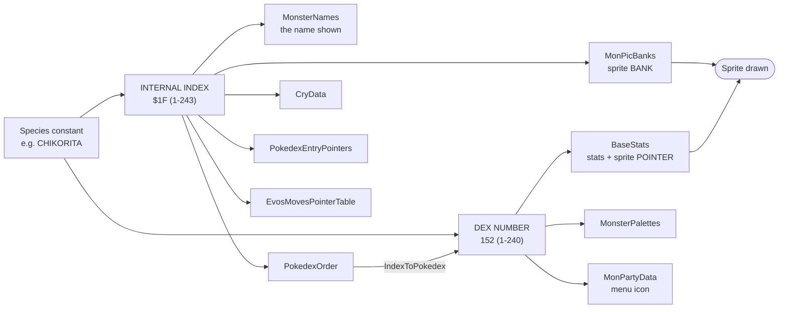

# Pokémon Data Map

**Where every piece of a Pokémon's data actually lives.** A single species is spread across ~14 files and two incompatible index systems. This note is the map; [[Master Index]] and the Dex detail pages are the contents.

## The two index systems

This is the most important thing on this page. Get it wrong and you produce plausible-looking, completely wrong data — with **no build error**.



The sprite needs its **bank** from one axis and its **pointer** from the other. If those disagree the game draws the wrong Pokémon — see [[Table Alignment - The Two Index Systems]].

## Every file a species touches

| What | File | Indexed by |
|---|---|---|
| Species constant | `constants/pokemon_constants.asm` | — (defines internal index) |
| Dex constant | `constants/pokedex_constants.asm` | — (defines dex number) |
| **Name** | `data/pokemon/names.asm` | internal index |
| **Base stats, types, catch rate, base exp, growth, level-1 moves, TM/HM flags, sprite pointers** | `data/pokemon/base_stats/<slug>.asm` → included by `base_stats.asm` | **dex number** |
| **Evolution + level-up learnset** | `data/pokemon/evos_moves.asm` | internal index |
| **Dex category, height, weight** | `data/pokemon/dex_entries.asm` | internal index |
| **Dex flavour prose** | `data/pokemon/dex_text.asm` | via `text_far` (bank-agnostic) |
| **Battle palette** | `data/pokemon/palettes.asm` | dex number |
| **Party menu icon** | `data/pokemon/menu_icons.asm` | dex number |
| **Cry** (base sfx, pitch, length) | `data/pokemon/cries.asm` | internal index |
| **Sprite bank** | `data/pokemon/pic_banks.asm` (generated) | internal index |
| **Front sprite** | `gfx/pokemon/front/<slug>.png` → `.pic` | via label |
| **Back sprite** | `gfx/pokemon/back/<slug>b.png` → `.pic` | via label |
| **Sprite INCBINs** | `gfx/pics.asm` (`Pics 1-5`, `Pics Gen2 1-6`) | — |
| **Wild encounters** | `data/wild/maps/*.asm` | by species constant |

## Sprite pipeline

```
gfx/pokemon/front/<slug>.png     (4-shade grayscale, 40/48/56 px square)
        │  rgbgfx --colors dmg   ← rejects ANY non-gray pixel
        ▼
gfx/pokemon/front/<slug>.pic     (compressed, gitignored)
        │  INCBIN in gfx/pics.asm
        ▼
<Slug>PicFront  ──► pointer stored in base_stats/<slug>.asm
                    bank stored in pic_banks.asm
```

Gen 2 source art is **colour-paletted**, so the importer re-quantises it to the four DMG grays by **luminance rank** (preserving which pixels are highlight vs shadow). Back sprites are additionally downscaled 48×48 → 32×32 NEAREST, since Gen 1 backs are uniformly 32×32.

## Rarity is slot order

Wild tables have exactly 10 slots and `data/wild/probabilities.asm` fixes each slot's chance — so a species' encounter rate is determined purely by **its position in the list**:

| Slot | 0 | 1 | 2 | 3 | 4 | 5 | 6 | 7 | 8 | 9 |
|---|---|---|---|---|---|---|---|---|---|---|
| Chance | 19.9% | 19.9% | 15.2% | 9.8% | 9.8% | 9.8% | 5.1% | 5.1% | 4.3% | 1.2% |

## Who generates what

| Generator | Produces |
|---|---|
| `tools/gen2_import.py` | Roster + index/dex assignment (`--manifest` to inspect) |
| `tools/gen2_emit.py` | All species tables, base stats, sprites, pic banks, dex entries |
| `tools/gen2_dex_text.py` | The authored gothic dex prose (hand-written data) |
| `tools/wild_tables.py` | Encounter tables |
| `tools/wild_report.py` | [[Encounter Map - Locations & Rates]], [[Where to Find Each Species]] |
| `tools/pokedex_report.py` | [[Master Index]] + the Dex detail pages |

**`gen2_emit.py` restores from `tools/gen2_pristine/` before patching** — its edits are not reversible in place, so re-running without that double-applies.

## Regenerating these notes

```sh
python tools/pokedex_report.py    # Master Index + Dex detail pages
python tools/wild_report.py       # encounter maps
```

Both read the **real data files**, not the generators' inputs, so they cannot drift from what is in the ROM. Regenerate after any species change rather than editing by hand.

## Related
- [[Master Index]] — all 240 species, one row each
- [[Dex 001-060]] · [[Dex 061-120]] · [[Dex 121-180]] · [[Dex 181-240]]
- [[Table Alignment - The Two Index Systems]] — why the two axes matter
- [[Kanto Reborn - Overview]] · [[Test Suite]]
